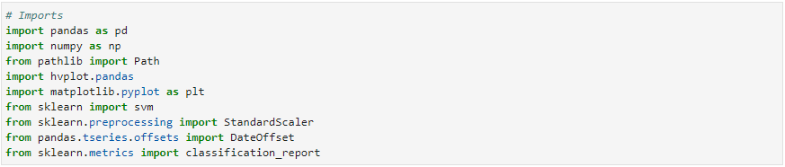
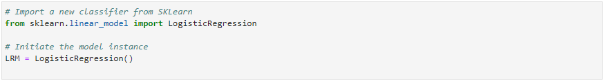
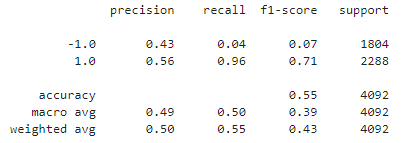
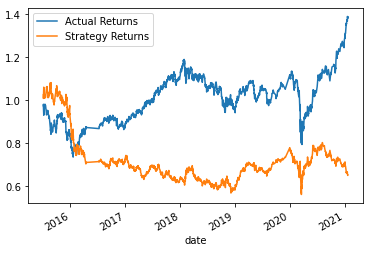
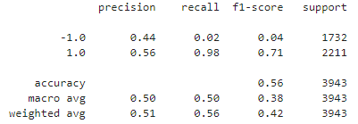
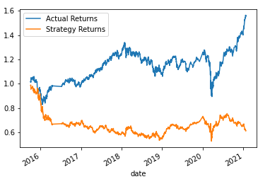
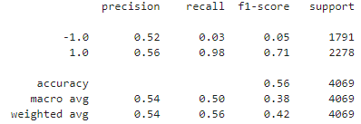
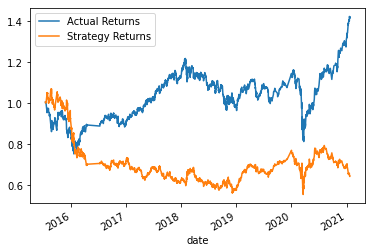

# Algorithmic_Trading

___
In this Challenge, I will assume the role of a financial advisor at one of the top five financial advisory firms in the world. The firm constantly competes with the other major firms to manage and automatically trade assets in a highly dynamic environment. In recent years, the firm has heavily profited by using computer algorithms that can buy and sell faster than human traders.

The speed of these transactions gave the firm a competitive advantage early on. But, people still need to specifically program these systems, which limits their ability to adapt to new data. As such, I will work on to improve the existing algorithmic trading systems and maintain the firm’s competitive advantage in the market. To do so, I will enhance the existing trading signals with machine learning algorithms that can adapt to new data.

I will use algorithmic trading skills discussed in class this week along with financial Python programming and machine learning to create an algorithmic trading bot that learns and adapts to new data and evolving markets. This Readme file walks through how I do so in my Jupyter Notebook:

* Implement an algorithmic trading strategy that uses machine learning to automate the trade decisions.
* Adjust the input parameters to optimize the trading algorithm.
* Train a new machine learning model and compare its performance to that of a baseline model.

---

## Usage
To use the analysis, clone the repository and run the machine_learning_trading_bot.ipynb file. First, ensure the following libraries are installed:

---

## Analysis

This analysis was completed in four sections: Establish a Baseline Performance, Tune the Baseline Trading Algorithm, Evaluate a New Machine Learning Classifier, and Create an Evaluation Report.

I - Establish a Baseline Performance

1) Import the OHLCV dataset into a Pandas DataFrame.

2) Generate trading signals using short- and long-window SMA values.

3) Split the data into training and testing datasets.

4) Use the SVC classifier model from SKLearn's support vector machine (SVM) learning method to fit the training data and make predictions based on the testing data. Review the predictions.

5) Review the classification report associated with the SVC model predictions.

6) Create a predictions DataFrame that contains columns for “Predicted” values, “Actual Returns”, and “Strategy Returns”.

7) Create a cumulative return plot that shows the actual returns vs. the strategy returns. Save a PNG image of this plot. This will serve as a baseline against which to compare the effects of tuning the trading algorithm.

8) Write your conclusions about the performance of the baseline trading algorithm in the README.md file that’s associated with your GitHub repository. Support your findings by using the PNG image that you saved in the previous step.

Conclusion - The precision for classes "-1" and "1" is 0.43 and 0.56, respectively, whereas the recall is 0.04 and 0.96, respectively. Given the higher recall, it appears that the model is better at predicting the class 1 than class -1. In other words, the model is better at predicting when to go long. Further, based on the plot, we can conclude that the Actual Return and Strategy Return went in the same direction from 2015 - 2016. However, after 2016, the Strategy Return does not appear to have performed as well as the Actual Returns.

II - Tune the Baseline Trading Algorithm

1) Tune the training algorithm by adjusting the size of the training dataset. I changed the training window from 3 months to 6 months for the following results.

By increasing the training window from 3 months to 6 months, the recall changed from 0.04 to 0.02 for Class -1 and from 0.96 to 0.98. This means that this specific change in training window led to a slightly higher recall for Class 1 and slightly lower recall for Class -1. In other words, it appears that this specific change in training window leads to a slightly better model in predicting longs but slightly worse at predicting shorts.

2) Tune the trading algorithm by adjusting the SMA input features. I reverted to the original training window inputs and increased the Short window from 4 to 50 and the Long window from 100 to 150. The following are the results.

By increasing both of the SMA windows, the recall for Class 1 increased from 0.96 to 0.98 while the precision stayed the same. However, the recall for class -1 went from 0.4 to 0.3 while the precision went from 0.44 to 0.52. This implies a more accurate model for predicting short than the original model. Whereas the model is about slightly better at predicting longs.

3) The parameters parameters that best improved the model where a training period of 3 months and short window of 50 and long window of 150. See above for the returns.

III - Evaluate a New Machine Learning Classifier

In this section, I revert to the original parameters  and apply them to the performance of a second machine learning model:

1) Import a new classifier - LogisticRegression

2) Using the original training data as the baseline model, fit another model with the new classifier.

3) Backtest the new model to evaluate its performance. 

Based on the classification report and the plot, the recall for Class -1 went from 0.04 to 0.33 where as the recall for Class 1 went from 0.96 to 0.66. The precision remained the same. This means that the new model gave mixed results compared to the orignal model and the tuned trading algorithm.

IV - Create an Evaluation Report.

By changing the training dataset to 6 months, the model did a slightly better job predicting Class -1 or shorts. The prediction for shorts improved further by hoinding the training constant but increasing the short and long windows from 4 and 100 to 50 and 150. However, the best prediction outcomes for shorts came when I adapted the Logistic Regression Model.

Comparatively, the prediction did not change significantly for Class 1 or longs when I tuned the training dataset to 6 months, or when I changed the short and long windows to 50 and 150 days. However, the recall decreased significantly for the longs when I adapted the Logistic Regression Model. 

Overall, it appears there are various ways to improve prediction outcomes for the different classes. It may benefit the firm to use different models for longs and shorts to maximize ability to predict outcomes.

---

## Contributors

Franco Thomas - francothomas1989@gmail.com

---

## License

MIT